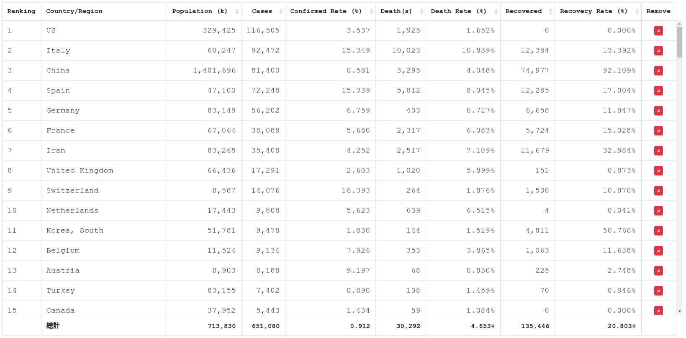

# COVID-19 Global Cases and Statistics
maintained by: `hkdb`

### Summary:

This is a fork of [ShawTim's wuhan-virus-infection](https://github.com/ShawTim/wuhan-virus-infection) repo to create an all English version of the [site](https://shawtim.github.io/wuhan-virus-infection/); making it available to share with English-Only audiences that would like to track statistics of China, Hong Kong, Macau, and Taiwan separately.

### Project By:

[3DF OSI](https://osi.3df.io)
